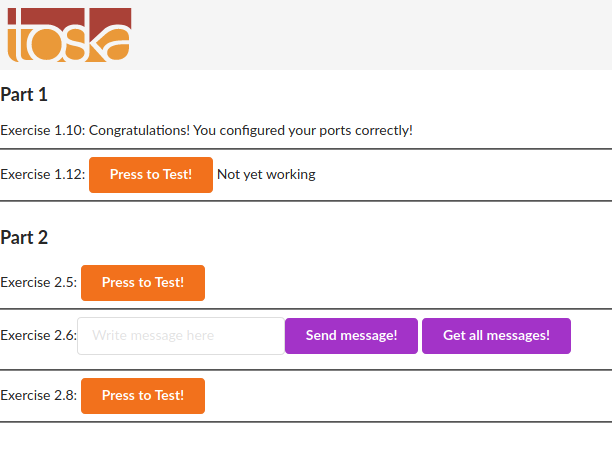
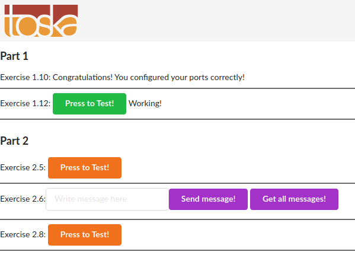

# Exercises for [part 1](https://devopswithdocker.com/part1/)

## 1.1 Getting started

Since we already did “Hello, World!” in the material let’s do something else.

Start 3 containers from image that does not automatically exit, such as nginx, detached.

Stop 2 of the containers leaving 1 up.

Submitting the output for docker ps -a is enough to prove this exercise has been done.

*Answer:*
```
 ⚙ cip  ~/Desktop/UNI/devopswithdocker  docker run -d nginx   
28cdbffadabbc166abfd80fb46d5b75c24bbf4eba78a2e13ba0af5c047ee1cd7
 ⚙ cip  ~/Desktop/UNI/devopswithdocker  docker run -d gitlab/gitlab-ce
292bbc155a069b061bb2ae5428639bbc5bf086d5852646e0c1c4e514269009c3
 ⚙ cip  ~/Desktop/UNI/devopswithdocker  docker run -d wurstmeister/kafka
2f6147080d353f9268d2c00ddfc89e7212800e3f4f3f9b1a3264e35f026c9b47
 ⚙ cip  ~/Desktop/UNI/devopswithdocker  docker ps -a                    
CONTAINER ID        IMAGE                COMMAND                  CREATED             STATUS                             PORTS                     NAMES
2f6147080d35        wurstmeister/kafka   "start-kafka.sh"         10 seconds ago      Exited (1) 9 seconds ago                                     happy_borg
292bbc155a06        gitlab/gitlab-ce     "/assets/wrapper"        22 seconds ago      Up 21 seconds (health: starting)   22/tcp, 80/tcp, 443/tcp   blissful_hofstadter
28cdbffadabb        nginx                "/docker-entrypoint.…"   27 seconds ago      Up 26 seconds                      80/tcp                    zen_hellman
 ⚙ cip  ~/Desktop/UNI/devopswithdocker  docker stop 2f6147080d35            
2f6147080d35
 ⚙ cip  ~/Desktop/UNI/devopswithdocker  docker stop 292bbc155a06
292bbc155a06
 ⚙ cip  ~/Desktop/UNI/devopswithdocker  docker ps -a            
CONTAINER ID        IMAGE                COMMAND                  CREATED              STATUS                       PORTS               NAMES
2f6147080d35        wurstmeister/kafka   "start-kafka.sh"         49 seconds ago       Exited (1) 48 seconds ago                        happy_borg
292bbc155a06        gitlab/gitlab-ce     "/assets/wrapper"        About a minute ago   Exited (137) 4 seconds ago                       blissful_hofstadter
28cdbffadabb        nginx                "/docker-entrypoint.…"   About a minute ago   Up About a minute            80/tcp              zen_hellman
 ⚙ cip  ~/Desktop/UNI/devopswithdocker  
```

## 1.2 Cleanup

We’ve left containers and a image that won’t be used anymore and are taking space, as docker ps -as and docker images will reveal.

Clean the docker daemon from all images and containers.

Submit the output for docker ps -a and docker images

*Answer:*
```
 ⚙ cip  ~/Desktop/UNI/devopswithdocker  docker images
REPOSITORY           TAG                 IMAGE ID            CREATED             SIZE
gitlab/gitlab-ce     latest              8ab13771717b        6 days ago          2.04GB
nginx                latest              f35646e83998        2 weeks ago         133MB
wurstmeister/kafka   latest              40094a582680        2 months ago        435MB
 ⚙ cip  ~/Desktop/UNI/devopswithdocker  docker ps -a 
CONTAINER ID        IMAGE               COMMAND             CREATED             STATUS              PORTS               NAMES
 ⚙ cip  ~/Desktop/UNI/devopswithdocker  docker rmi 8ab13771717b
Untagged: gitlab/gitlab-ce:latest
Untagged: gitlab/gitlab-ce@sha256:2c329e4b32adb1f5a396401b34ab1ee7197eb30bb4c63ff20fe53381fd70ac07
Deleted: sha256:8ab13771717ba0518096a76b36d8643a9b30562ed6a8e344c9d7ff8f0f1ab964
Deleted: sha256:927a6e983863c7989f3856382a111235722a70619e4e2378eb1d1cbd5f4b59c8
Deleted: sha256:88afe332290d1fa85ad10eb25a6c48fb92bd6925170756c219f8e9eb5e9afdfc
Deleted: sha256:11aeb63b9c8f948fdf73e7a0924840bfba7f4a6009053608d1b0497c46c8d266
Deleted: sha256:770796052fd1f00264888b9de9a78ca26576e0aa80cb0180279ab758080b1572
Deleted: sha256:0e53fc3d2d34807fc3d185555f20faf43a9e54e6e36a831ce5945d9a984bca76
Deleted: sha256:2f5f585327bbdbae9a93bfe28dca994248d5e6c5b72e2b8d3d3a9202ef4db8fa
Deleted: sha256:b8d6781b2914e44c86b1f158105f220044db7a1e9daf4f55f366dcd888003513
Deleted: sha256:b317b787bb952652819917ee6a67b6c3ce01487798e8f0523608a5903a1420ff
Deleted: sha256:e7623e01200a173d013d81f141cf2210c13657cecb61bf0718409174da3d483c
Deleted: sha256:f577d0e0bf7011714547f1ea1e3536cad7d8575a4a6357fae65b7e8a42914889
 ⚙ cip  ~/Desktop/UNI/devopswithdocker  docker rmi f35646e83998            
Untagged: nginx:latest
Untagged: nginx@sha256:ed7f815851b5299f616220a63edac69a4cc200e7f536a56e421988da82e44ed8
Deleted: sha256:f35646e83998b844c3f067e5a2cff84cdf0967627031aeda3042d78996b68d35
Deleted: sha256:9ae13393c37dce86ebd3ea923033503f2cb8f4d6b28fb554827c518a2d171535
Deleted: sha256:423bc419c558f70051d849a661a7a287b61af2037c4ce24f7bbe433e9fb63f39
Deleted: sha256:4cd04e685e3a8e5697bb91e2e6c6b477bc8c4f9a43f05578af3c0a788f011756
Deleted: sha256:611e1562bc2f489d72961d8e2e37f3097d64d9c5212a68c26aab2ad971c98f6d
Deleted: sha256:d0fe97fa8b8cefdffcef1d62b65aba51a6c87b6679628a2b50fc6a7a579f764c
 ⚙ cip  ~/Desktop/UNI/devopswithdocker  docker rmi 40094a582680            
Untagged: wurstmeister/kafka:latest
Untagged: wurstmeister/kafka@sha256:9be6d5ae19a6455998883fffe0e46ac9dcbee4d09861c791df97ed1883f03c49
Deleted: sha256:40094a5826806d0db6b56bd9f5191649df4290af91ba042545fb5a164574e766
Deleted: sha256:db53492743beed716166777e0e7d4790d39171015f06b107a6411f8e2e8da476
Deleted: sha256:5ab36a1a5e768a1a492113bd7a4a09c99499351501e2dd72d6f6035f73880d13
Deleted: sha256:fd448a40e7c41ba1d53ac6a873223b93d8b72b67ffcd1cb7c8b8556356a8461a
Deleted: sha256:aba8cd4318a8a15f59f305368e49cc3bbd0d6d72171a0b24d08cc00513b14ef4
Deleted: sha256:c318fbba92645a83843c387bd78497e7b143ecc7f5ed99dcb7d38fc62442c02a
Deleted: sha256:f1b5933fe4b5f49bbe8258745cf396afe07e625bdab3168e364daf7c956b6b81
 ⚙ cip  ~/Desktop/UNI/devopswithdocker  docker images          
REPOSITORY          TAG                 IMAGE ID            CREATED             SIZE
 ⚙ cip  ~/Desktop/UNI/devopswithdocker  docker ps -a  
CONTAINER ID        IMAGE               COMMAND             CREATED             STATUS              PORTS               NAMES
 ⚙ cip  ~/Desktop/UNI/devopswithdocker  

```

## 1.3 Hello Docker Hub

Start image `devopsdockeruh/pull_exercise` with flags `-it` like so: `docker run -it devopsdockeruh/pull_exercise`. It will wait for your input. Navigate through docker hub to find the docs and Dockerfile that was used to create the image.

Read the Dockerfile and/or docs to learn what input will get the application to answer a “secret message”.

Submit the secret message and command(s) given to get it as your answer.

*Answer:*
```
 cip  ~  docker run -it devopsdockeruh/pull_exercise
Unable to find image 'devopsdockeruh/pull_exercise:latest' locally
latest: Pulling from devopsdockeruh/pull_exercise
8e402f1a9c57: Pull complete 
5e2195587d10: Pull complete 
6f595b2fc66d: Pull complete 
165f32bf4e94: Pull complete 
67c4f504c224: Pull complete 
Digest: sha256:7c0635934049afb9ca0481fb6a58b16100f990a0d62c8665b9cfb5c9ada8a99f
Status: Downloaded newer image for devopsdockeruh/pull_exercise:latest
Give me the password: basics
You found the correct password. Secret message is:
"This is the secret message"
```
## 1.4

Now that we’ve warmed up it’s time to get inside a container while it’s running!

Start image `devopsdockeruh/exec_bash_exercise`, it will start a container with clock-like features and create a log. Go inside the container and use `tail -f ./logs.txt` to follow the logs. Every 15 seconds the clock will send you a “secret message”.

Submit the secret message and command(s) given as your answer.

*Answer:*
```
 cip  ~  docker run -d --name exec_bash_exercise devopsdockeruh/exec_bash_exercise
Unable to find image 'devopsdockeruh/exec_bash_exercise:latest' locally
latest: Pulling from devopsdockeruh/exec_bash_exercise
1c6172af85ee: Pull complete 
b194b0e3c928: Pull complete 
1f5ec00f35d5: Pull complete 
93b1353672b6: Pull complete 
3d7f38db3cca: Pull complete 
21e102f9fe89: Pull complete 
d851ffed797c: Pull complete 
a45031e28c68: Pull complete 
ca3c1414856f: Pull complete 
02c74c9936fd: Pull complete 
ddb55f8ab0a8: Pull complete 
Digest: sha256:d38b6f6b0eed2880e25c9eb7f83f1cd016ffe3a56c9a3fec6e7bee480bf1ed0f
Status: Downloaded newer image for devopsdockeruh/exec_bash_exercise:latest
2239dfd7e4c7cf6663e28a8ea7da10ababf465a91edc77439896417fa8c9540a
 cip  ~  docker exec -it exec_bash_exercise bash                                  
root@42333edea99f:/usr/app# tail -f ./logs.txt
Secret message is:
"Docker is easy"
Thu, 29 Oct 2020 13:15:38 GMT
Thu, 29 Oct 2020 13:15:41 GMT
Thu, 29 Oct 2020 13:15:44 GMT
Thu, 29 Oct 2020 13:15:47 GMT
Secret message is:
"Docker is easy"
Thu, 29 Oct 2020 13:15:53 GMT
Thu, 29 Oct 2020 13:15:56 GMT
Thu, 29 Oct 2020 13:15:59 GMT
Thu, 29 Oct 2020 13:16:02 GMT
Secret message is:
"Docker is easy"
```

## 1.5

Start a ubuntu image with the process `sh -c 'echo "Input website:"; read website; echo "Searching.."; sleep 1; curl http://$website;'`

You will notice that a few things required for proper execution are missing. Be sure to remind yourself which flags to use so that the read actually waits for input.

> Note also that curl is NOT installed in the container yet. You will have to install it from inside of the container.

Test inputting `helsinki.fi` into the application. It should respond with something like
```html
<html>

<head>
  <title>301 Moved Permanently</title>
</head>

<body>
  <h1>Moved Permanently</h1>
  <p>The document has moved <a href="http://www.helsinki.fi/">here</a>.</p>
</body>

</html>
```

This time return the command you used to start process and the command(s) you used to fix the ensuing problems.

> This exercise has multiple solutions, if the curl for helsinki.fi works then it’s done. Can you figure out other (smart) solutions?

*Answer:*
```
 cip  ~  docker run -it --name ubuntu_ex_1_5 ubuntu:latest sh -c 'apt-get update && apt-get install -y curl; echo "Input website:"; read website; echo "Searching.."; sleep 1; curl http://$website;'
Get:1 http://security.ubuntu.com/ubuntu focal-security InRelease [107 kB]
Get:2 http://archive.ubuntu.com/ubuntu focal InRelease [265 kB]

[ ... *Updating and fetching / installing curl* ... ]

Setting up curl (7.68.0-1ubuntu2.2) ...
Processing triggers for libc-bin (2.31-0ubuntu9.1) ...
Processing triggers for ca-certificates (20201027ubuntu0.20.04.1) ...
Updating certificates in /etc/ssl/certs...
0 added, 0 removed; done.
Running hooks in /etc/ca-certificates/update.d...
done.
Input website:
helsinki.fi
Searching..
<!DOCTYPE HTML PUBLIC "-//IETF//DTD HTML 2.0//EN">
<html><head>
<title>301 Moved Permanently</title>
</head><body>
<h1>Moved Permanently</h1>
<p>The document has moved <a href="http://www.helsinki.fi/">here</a>.</p>
</body></html>
```

## 1.6

Create a Dockerfile that starts with `FROM devopsdockeruh/overwrite_cmd_exercise`. Add a `CMD` line to the Dockerfile.

The developer has poorly documented how the application works. Nevertheless once you will execute an application (run a container from an image) you will have some clues on how it works. Your task is to run an application so that it will simulate a clock functionality.

When you will build an image tag it as “`docker-clock`” so that `docker run docker-clock` starts the application.

Return both Dockerfile(s) and the command you used to run the container(s)

*Answer:*
```
 cip  ~/Desktop/UNI/devopswithdocker/Part_1/1_6   master  docker build -t docker-clock . 
Sending build context to Docker daemon  2.048kB
Step 1/1 : FROM devopsdockeruh/overwrite_cmd_exercise
 ---> 3d2b622b1849
Successfully built 3d2b622b1849
Successfully tagged docker-clock:latest
 cip  ~/Desktop/UNI/devopswithdocker/Part_1/1_6   master  docker run docker-clock        

-h,       	--help           	to show this message
-a [age], 	--adult [age]    	to check if you're older than 18
-c [time],	--clock [time]   	to start a clock
-t [size],	--triangle [size]	to draw a triangle, takes second argument as the size
    
 cip  ~/Desktop/UNI/devopswithdocker/Part_1/1_6   master  docker run docker-clock --clock
1
2
3
4
5
```

*Contents of Dockerfile (Actual Dockerfile in folder 1_6):*
```docker
FROM devopsdockeruh/overwrite_cmd_exercise
```

## 1.7

Now that we know how to create and build Dockerfiles we can improve previous works.

Create a Dockerfile for a new image that starts `from ubuntu:16.04`.

Make a script file on you local machine with such content as `echo "Input website:"; read website; echo "Searching.."; sleep 1; curl http://$website;`. Transfer this file to an image and run it inside the container using `CMD`. Build the image with tag “`curler`”.

Run command `docker run [options] curler` (with correct flags again, as in 1.5) and input `helsinki.fi` into it. Output should match the 1.5 one.

Return both Dockerfile(s) and the command you used to run the container(s)

*Answer:*
```
 cip  ~/Desktop/UNI/devopswithdocker/Part_1/1_7   master ±  docker build -t curler .
Sending build context to Docker daemon  3.072kB
Step 1/4 : FROM ubuntu:16.04
 ---> dfeff22e96ae
Step 2/4 : RUN apt-get update -y && apt-get install curl -y
 ---> Using cache
 ---> aef657d1e7f2
Step 3/4 : COPY script.sh .
 ---> Using cache
 ---> bba5272bd4bd
Step 4/4 : CMD ["/bin/bash", "script.sh"]
 ---> Using cache
 ---> bd25139ad7f8
Successfully built bd25139ad7f8
Successfully tagged curler:latest
 cip  ~/Desktop/UNI/devopswithdocker/Part_1/1_7   master ±  docker run -it curler   
Input website:
helsinki.fi
Searching..
<!DOCTYPE HTML PUBLIC "-//IETF//DTD HTML 2.0//EN">
<html><head>
<title>301 Moved Permanently</title>
</head><body>
<h1>Moved Permanently</h1>
<p>The document has moved <a href="http://www.helsinki.fi/">here</a>.</p>
</body></html>
```

*Contents of Dockerfile (Actual Dockerfile in folder 1_7):*
```docker
FROM ubuntu:16.04

RUN apt-get update -y && apt-get install curl -y

COPY script.sh .

CMD ["/bin/bash", "script.sh"]
```

## 1.8

In this exercise we won’t create a new Dockerfile. Image `devopsdockeruh/first_volume_exercise` has instructions to create a log into `/usr/app/logs.txt`. Start the container with bind mount so that the logs are created into your filesystem.

Submit your used commands for this exercise.

*Answer:*
```
 cip  ~/Desktop/UNI/devopswithdocker/Part_1   master ±  touch logs.txt   

 cip  ~/Desktop/UNI/devopswithdocker/Part_1   master ±  docker run -v $(pwd)/logs.txt:/usr/app/logs.txt devopsdockeruh/first_volume_exercise
Wrote to file /usr/app/logs.txt
Wrote to file /usr/app/logs.txt
```
And from another terminal we can monitor the log file
```
 cip  ~/Desktop/UNI/devopswithdocker/Part_1   master ±  tail -f logs.txt   
Thu, 29 Oct 2020 14:56:19 GMT
Thu, 29 Oct 2020 14:56:22 GMT
Thu, 29 Oct 2020 14:56:25 GMT
Thu, 29 Oct 2020 14:56:28 GMT
Secret message is:
"Volume bind mount is easy"
Thu, 29 Oct 2020 14:56:34 GMT
Thu, 29 Oct 2020 14:56:37 GMT
Thu, 29 Oct 2020 14:56:40 GMT
Thu, 29 Oct 2020 14:56:43 GMT
Secret message is:
"Volume bind mount is easy"
Thu, 29 Oct 2020 14:56:49 GMT
Thu, 29 Oct 2020 14:56:52 GMT
```

## 1.9

In this exercise we won’t create a new Dockerfile. Image `devopsdockeruh/ports_exercise` will start a web service in port `80`. Use `-p` flag to access the contents with your browser.

Submit your used commands for this exercise.

*Answer:*
```
 cip  ~/Desktop/UNI/devopswithdocker   master ±  docker run -p 80:80 devopsdockeruh/ports_exercise                                   
Unable to find image 'devopsdockeruh/ports_exercise:latest' locally
latest: Pulling from devopsdockeruh/ports_exercise
cbdbe7a5bc2a: Pull complete 
fb0e3739aee1: Pull complete 
738de7869598: Pull complete 
ffd68be3d86c: Pull complete 
d6a92ac5065d: Pull complete 
8deb0960be38: Pull complete 
aec7a3bd83e0: Pull complete 
8f73392c117e: Pull complete 
Digest: sha256:9779e303353ef47da9ea0223bfbb9fbdb8f8fe39178e2e06153027e28e9e5400
Status: Downloaded newer image for devopsdockeruh/ports_exercise:latest

> ports_exercise@1.0.0 start /usr/app
> node index.js

Listening on port 80, this means inside of the container. Use -p to map the port to a port of your local machine.
```

And from the browser, when I try to access localhost: `Ports configured correctly!!`

## 1.10 Frontend

**This exercise is mandatory**

A good developer creates well written READMEs that can be used to create Dockerfiles with ease.

Clone, fork or download a project from https://github.com/docker-hy/frontend-example-docker.

Create a Dockerfile for the project and give a command so that the project runs in a docker container with port `5000` exposed and published so when you start the container and navigate to `http://localhost:5000` you will see message if you’re successful.

Submit the Dockerfile.

As in other exercises, do not alter the code of the project

  >**TIP**: The project has install instructions in README.

  > **TIP**: Note that the app starts to accept connections when “`Accepting connections at http://localhost:5000`” has been printed to the screen, this takes a few seconds

  > **TIP**: You do not have to install anything new outside containers.

*Answer:*

Building image:
```
 cip  ~/Desktop/UNI/devopswithdocker/1_10   master ±  docker build -t ex_1_10 .
Sending build context to Docker daemon   2.56kB
Step 1/13 : FROM ubuntu:latest
 ---> d70eaf7277ea
Step 2/13 : RUN apt-get update -y && apt-get install git curl -y

[ ... *Installing dependencies / fetching program / installing* ... ]
```

Running image:
```
 cip  ~/Desktop/UNI/devopswithdocker/1_10   master ±  docker run -p 5000:5000 ex_1_10
INFO: Accepting connections at http://localhost:5000
```

*Contents of Dockerfile (Actual Dockerfile in folder 1_10):*
``` docker
FROM ubuntu:latest

RUN apt-get update -y && apt-get install git curl -y

# Installation instructions from https://github.com/docker-hy/frontend-example-docker
RUN curl -sL https://deb.nodesource.com/setup_10.x | bash
RUN apt-get update -y && apt install -y nodejs

# Check install
RUN node -v && npm -v

RUN git clone https://github.com/docker-hy/frontend-example-docker
RUN mv frontend-example-docker /usr/local/www

WORKDIR /usr/local/www

RUN npm install
RUN npm run build
RUN npm install -g serve

EXPOSE 5000

CMD serve -s -l 5000 dist
```

Output:



## 1.11 Backend

**This exercise is mandatory**

Clone, fork or download a project from `https://github.com/docker-hy/backend-example-docker`.

Create a Dockerfile for the project and give a command so that the project runs in a docker container with port `8000` exposed and published so when you start the container and navigate to `http://localhost:8000` you will generate a message in logs.txt in the working directory.

Create a volume for the `logs.txt` so that when the application is shut down the logs are not destroyed. And when restarted it continues to write into the same `logs.txt`.

Submit the Dockerfile and the command used.

*Do not alter the code of the project*

*Answer:*
```
 cip  ~/Desktop/UNI/devopswithdocker/Part_1/1_11   master ±  docker run -p 8000:8000 -v $(pwd)/logs.txt:/usr/local/www/logs.txt ex_1_11 

> backend-example-docker@1.0.0 start /usr/local/www
> node index.js

ENV values set as follows: { DB:
   { username: undefined,
     password: undefined,
     database: undefined,
     host: 'localhost' },
  PORT: 8000,
  FRONT_URL: '',
  REDIS: undefined,
  REDIS_PORT: 6379 }
[Exercise 2.6+] DB_USERNAME and/or DB_PASSWORD are not defined, skipping db connection
[Exercise 2.5+] REDIS is not defined, skipping redis connection
Started on port 8000
::ffff:172.17.0.1 - GET / HTTP/1.1 304 - - 4.927 ms
::ffff:172.17.0.1 - GET / HTTP/1.1 304 - - 0.535 ms
::ffff:172.17.0.1 - GET / HTTP/1.1 304 - - 0.437 ms
::ffff:172.17.0.1 - GET / HTTP/1.1 304 - - 0.265 ms
::ffff:172.17.0.1 - GET / HTTP/1.1 304 - - 0.388 ms
::ffff:172.17.0.1 - GET / HTTP/1.1 304 - - 0.270 ms
::ffff:172.17.0.1 - GET / HTTP/1.1 304 - - 0.254 ms
::ffff:172.17.0.1 - GET / HTTP/1.1 304 - - 0.255 ms
 ✘ cip  ~/Desktop/UNI/devopswithdocker/Part_1/1_11   master ±  cat logs.txt
10/29/2020, 4:08:44 PM: Connection received in root
10/29/2020, 4:08:49 PM: Connection received in root
10/29/2020, 4:08:50 PM: Connection received in root
10/29/2020, 4:08:50 PM: Connection received in root
10/29/2020, 4:08:50 PM: Connection received in root
10/29/2020, 4:08:50 PM: Connection received in root
10/29/2020, 4:08:50 PM: Connection received in root
10/29/2020, 4:08:50 PM: Connection received in root
 cip  ~/Desktop/UNI/devopswithdocker/Part_1/1_11   master ±  docker run -p 8000:8000 -v $(pwd)/logs.txt:/usr/local/www/logs.txt ex_1_11

> backend-example-docker@1.0.0 start /usr/local/www
> node index.js

ENV values set as follows: { DB:
   { username: undefined,
     password: undefined,
     database: undefined,
     host: 'localhost' },
  PORT: 8000,
  FRONT_URL: '',
  REDIS: undefined,
  REDIS_PORT: 6379 }
[Exercise 2.6+] DB_USERNAME and/or DB_PASSWORD are not defined, skipping db connection
[Exercise 2.5+] REDIS is not defined, skipping redis connection
Started on port 8000
::ffff:172.17.0.1 - GET / HTTP/1.1 304 - - 6.624 ms
::ffff:172.17.0.1 - GET / HTTP/1.1 304 - - 0.611 ms
::ffff:172.17.0.1 - GET / HTTP/1.1 304 - - 0.345 ms
::ffff:172.17.0.1 - GET / HTTP/1.1 304 - - 0.267 ms
::ffff:172.17.0.1 - GET / HTTP/1.1 304 - - 0.301 ms
::ffff:172.17.0.1 - GET / HTTP/1.1 304 - - 0.540 ms
 ✘ cip  ~/Desktop/UNI/devopswithdocker/Part_1/1_11   master ±  cat logs.txt                                                              
10/29/2020, 4:08:44 PM: Connection received in root
10/29/2020, 4:08:49 PM: Connection received in root
10/29/2020, 4:08:50 PM: Connection received in root
10/29/2020, 4:08:50 PM: Connection received in root
10/29/2020, 4:08:50 PM: Connection received in root
10/29/2020, 4:08:50 PM: Connection received in root
10/29/2020, 4:08:50 PM: Connection received in root
10/29/2020, 4:08:50 PM: Connection received in root
10/29/2020, 4:09:44 PM: Connection received in root
10/29/2020, 4:09:44 PM: Connection received in root
10/29/2020, 4:09:45 PM: Connection received in root
10/29/2020, 4:09:45 PM: Connection received in root
10/29/2020, 4:09:45 PM: Connection received in root
10/29/2020, 4:09:45 PM: Connection received in root
```

Even after stopping and restarting the container, the contents of `logs.txt` are kept.

*Contents of Dockerfile (Actual Dockerfile in folder 1_11):*
```docker
FROM ubuntu:latest

RUN apt-get update -y && apt-get install git curl -y

# Installation instructions from https://github.com/docker-hy/backend-example-docker
RUN curl -sL https://deb.nodesource.com/setup_10.x | bash
RUN apt-get update -y && apt install -y nodejs

# Check install
RUN node -v && npm -v

RUN git clone https://github.com/docker-hy/backend-example-docker
RUN mv backend-example-docker /usr/local/www

WORKDIR /usr/local/www

RUN npm install

EXPOSE 8000

CMD npm start
```

## 1.12 Putting them together

**This exercise is mandatory**

Start both frontend-example and backend-example with correct ports exposed and add ENV to Dockerfile with necessary information from both READMEs ([front](https://github.com/docker-hy/frontend-example-docker),[back](https://github.com/docker-hy/backend-example-docker)).

Ignore the backend configurations until frontend sends requests to `_backend_url_/ping` when you press the button.

You know that the configuration is ready when the button for 1.12 of frontend-example responds and turns green.

*Do not alter the code of either project*

Submit the edited Dockerfiles and commands used to run.


  > The frontend will first talk to your browser. Then the code will be executed from your browser and that will send a message to backend.


  > TIP: When configuring web applications keep browser developer console ALWAYS open, F12 or cmd+shift+I when the browser window is open. Information about configuring cross origin requests is in README of the backend project.

  > TIP: Developer console has multiple views, most important ones are Console and Network. Exploring the Network tab can give you a lot of information on where messages are being sent and what is received as response!

*Answer:*

For the front-end I add the lines
```
ENV API_URL=http://localhost:8000
RUN npm run build
```
in the [Dockerfile](1_10/Dockerfile), I rebuild the image and I run it with the command `docker run -p 5000:5000 ex_1_10`, just in exercise `1_10`.

For the back-end I add the line
```
ENV FRONT_URL=http://localhost:5000
```
in the [Dockerfile](1_11/Dockerfile), I rebuild the image and I run it with the command `docker run -p 8000:8000 -v $(pwd)/logs.txt:/usr/local/www/logs.txt ex_1_11`, just in exercise `1_11`.

This is the response in the browser:



## 1.13

Lets create a Dockerfile for a Java Spring project: [github page](https://github.com/docker-hy/spring-example-project).

The setup should be straightforward with the README instructions. Tips to get you started:

Use [openjdk image](https://hub.docker.com/_/openjdk) `FROM openjdk:_tag_` to get java instead of installing it manually. Pick the tag by using the README and dockerhub page.

You’ve completed the exercise when you see a `‘Success’` message in your browser.

*Answer:*

Building the image and running the container:
```
docker build -t ex_1_13 .
docker run -p 8080:8080 ex_1_13
```

*Contents of Dockerfile (Actual Dockerfile in folder 1_13):*
```docker
FROM openjdk:8

RUN git clone https://github.com/docker-hy/spring-example-project /usr/local/java

WORKDIR /usr/local/java

RUN ./mvnw package

EXPOSE 8080

CMD java -jar ./target/docker-example-1.1.3.jar
```

## 1.14

Lets create a Dockerfile for a rails project: [github page](https://github.com/docker-hy/rails-example-project).

Again we can take a look at the README for the project to see the installation instructions. Tips to get you started:

Use [Ruby image](https://hub.docker.com/_/ruby) `FROM ruby:_tag_` to easily get most of what you’ll need at the beginning. Pick the tag by using the README and dockerhub page.

If you want you can make small edits to the program if you get stuck and google doesn’t help you configure the setup. If you did, explain the edits with your submission of the Dockerfile.

You’ve completed the exercise when the application works in your browser.

## 1.15

Create Dockerfile for an application or any other dockerised project in any of your own repositories and publish it to Docker Hub. This can be any project except clones / forks of backend-example or frontend-example.

For this exercise to be complete you have to provide the link to the project in docker hub, make sure you at least have a basic description and instructions for how to run the application in a [README](https://help.github.com/en/articles/about-readmes) that’s available through your submission.

## 1.16

Pushing to heroku happens in a similar way. A project has already been prepared at `devopsdockeruh/heroku-example` so lets pull that first. Note that the image of the project is quite large.

Go to [https://www.heroku.com/](https://www.heroku.com/) and create a new app there and install heroku CLI. You can find additional instructions from Deploy tab under `Container Registry`. Tag the pulled image as `registry.heroku.com/_app_/_process-type_`, process-type can be web for this exercise. The app should be your project name in heroku.

Then push the image to heroku with docker push `registry.heroku.com/_app_/web` and release it using the heroku CLI: `heroku container:release web` (you might need to login first: `heroku container:login`)

For this exercise return the url in which the released application is.

You could also use the heroku CLI to build and push, but since we didn’t want to build anything this time it was easier to just tag the image.

## 1.17

Create an image that contains your favorite programming environment in it’s entirety.

This means that a computer that only has docker can use the image to start a container which contains all the tools and libraries. Excluding IDE / Editor. The environment can be partially used by running commands manually inside the container.

Explain what you created and publish it to Docker Hub.
