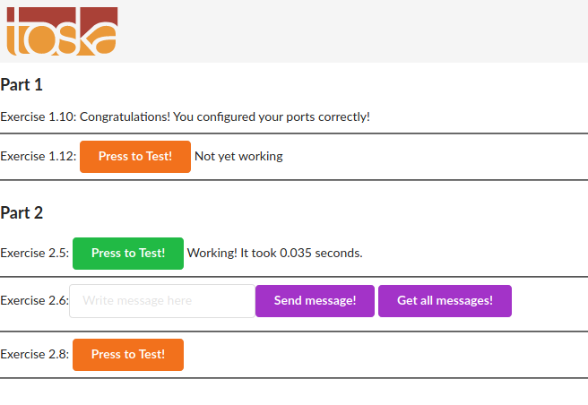

# Exercises for [part 2](https://devopswithdocker.com/part2/)

## 2.1

Exercises in part 2 should be done using `docker-compose`.

Container of `devopsdockeruh/first_volume_exercise` will create logs into its `/usr/app/logs.txt`.

Create a `docker-compose.yml` file that starts `devopsdockeruh/first_volume_exercise` and saves the logs into your filesystem.

Submit the `docker-compose.yml`, make sure that it works simply by running `docker-compose up` if the log file exists.

*Answer:*
```
 ✘ cip  ~/Desktop/UNI/devopswithdocker/Part_2/2_1   master ±  docker-compose up   
Creating network "2_1_default" with the default driver
Creating ex_2_1 ... done
Attaching to ex_2_1
ex_2_1    | Wrote to file /usr/app/logs.txt
ex_2_1    | Wrote to file /usr/app/logs.txt
ex_2_1    | Wrote to file /usr/app/logs.txt
ex_2_1    | Wrote to file /usr/app/logs.txt
ex_2_1    | Wrote to file /usr/app/logs.txt
ex_2_1    | Wrote to file /usr/app/logs.txt
^CGracefully stopping... (press Ctrl+C again to force)
Stopping ex_2_1 ... done
```
The `logs.txt` file is being edited by the processes in the container.
```
 cip  ~/Desktop/UNI/devopswithdocker/Part_2/2_1   master ±  tail -f logs.txt
Thu, 29 Oct 2020 19:20:41 GMT
Thu, 29 Oct 2020 19:20:44 GMT
Secret message is:
"Volume bind mount is easy"
Thu, 29 Oct 2020 19:20:50 GMT
Thu, 29 Oct 2020 19:20:53 GMT
Thu, 29 Oct 2020 19:20:56 GMT
Thu, 29 Oct 2020 19:20:59 GMT
Secret message is:
"Volume bind mount is easy"
Thu, 29 Oct 2020 19:21:05 GMT
Thu, 29 Oct 2020 19:21:08 GMT
```

Contents of `docker-compose.yml` (Actual `docker-compose.yml` in folder 2_1):
```docker
version: '3' 

services: 
    ex_2_1:  
      image: devopsdockeruh/first_volume_exercise
      build: . 
      volumes: 
        - ./logs.txt:/usr/app/logs.txt
      container_name: ex_2_1
```

## 2.2

`devopsdockeruh/ports_exercise` starts a web service that will answer in port `80`.

Create a `docker-compose.yml` and use it to start the service so that you can use it with your browser.

Submit the `docker-compose.yml`, make sure that it works simply by running `docker-compose up`.

*Answer:*
```
 cip  ~/Desktop/UNI/devopswithdocker/Part_2/2_2   master ±  docker-compose up
Creating network "2_2_default" with the default driver
Creating ex_2_2 ... done
Attaching to ex_2_2
ex_2_2    | 
ex_2_2    | > ports_exercise@1.0.0 start /usr/app
ex_2_2    | > node index.js
ex_2_2    | 
ex_2_2    | Listening on port 80, this means inside of the container. Use -p to map the port to a port of your local machine.
```

Contents of `docker-compose.yml` (Actual `docker-compose.yml` in folder 2_2):
```docker
version: '3' 

services: 
    ex_2_2:  
      image: devopsdockeruh/ports_exercise
      build: . 
      ports: 
        - 80:80
      container_name: ex_2_2
```

The answer from the browser went calling `http://localhost:80/` : `Ports configured correctly!!`.

## 2.3

**This exercise is mandatory**

As we saw previously, starting an application with two programs was not trivial and the commands got a bit long.

Since we already created working Dockerfiles for both frontend and backend we can go step further and simplify the usage into one `docker-compose.yml`.

Configure the backend and frontend from part 1 to work in docker-compose.

Submit the docker-compose.yml

*Answer:*
```
 cip  ~/Desktop/UNI/devopswithdocker/Part_2/2_3   master ±  docker-compose up --build
Building ex_2_3_frontend
Step 1/15 : FROM ubuntu:latest
 ---> d70eaf7277ea
Step 2/15 : RUN apt-get update -y && apt-get install git curl -y
 ---> Using cache
 ---> c61630a9a575
Step 3/15 : RUN curl -sL https://deb.nodesource.com/setup_10.x | bash
 ---> Using cache
 ---> 8041a399392c
Step 4/15 : RUN apt-get update -y && apt install -y nodejs
 ---> Using cache
 ---> 57e3a2d05f21
Step 5/15 : RUN node -v && npm -v
 ---> Using cache
 ---> b1329b25b423
Step 6/15 : RUN git clone https://github.com/docker-hy/frontend-example-docker
 ---> Using cache
 ---> 1db4b0474960
Step 7/15 : RUN mv frontend-example-docker /usr/local/www
 ---> Using cache
 ---> c2819d445756
Step 8/15 : WORKDIR /usr/local/www
 ---> Using cache
 ---> 24b530df550e
Step 9/15 : RUN npm install
 ---> Using cache
 ---> 1d6210c342a2
Step 10/15 : RUN npm run build
 ---> Using cache
 ---> c12263cbe028
Step 11/15 : RUN npm install -g serve
 ---> Using cache
 ---> 12f7a1c139a4
Step 12/15 : EXPOSE 5000
 ---> Using cache
 ---> c9afae0d3639
Step 13/15 : ENV API_URL=http://localhost:8000
 ---> Using cache
 ---> 43c919ccdc3b
Step 14/15 : RUN npm run build
 ---> Using cache
 ---> 1901105e2260
Step 15/15 : CMD serve -s -l 5000 dist
 ---> Using cache
 ---> b8cd5245307d
Successfully built b8cd5245307d
Successfully tagged frontend:latest
Building ex_2_3_backend
Step 1/12 : FROM ubuntu:latest
 ---> d70eaf7277ea
Step 2/12 : RUN apt-get update -y && apt-get install git curl -y
 ---> Using cache
 ---> c61630a9a575
Step 3/12 : RUN curl -sL https://deb.nodesource.com/setup_10.x | bash
 ---> Using cache
 ---> 8041a399392c
Step 4/12 : RUN apt-get update -y && apt install -y nodejs
 ---> Using cache
 ---> 57e3a2d05f21
Step 5/12 : RUN node -v && npm -v
 ---> Using cache
 ---> b1329b25b423
Step 6/12 : RUN git clone https://github.com/docker-hy/backend-example-docker
 ---> Using cache
 ---> f0591b8bdf75
Step 7/12 : RUN mv backend-example-docker /usr/local/www
 ---> Using cache
 ---> 9a40da2836e5
Step 8/12 : WORKDIR /usr/local/www
 ---> Using cache
 ---> 05ebd947353b
Step 9/12 : ENV FRONT_URL=http://localhost:5000
 ---> Using cache
 ---> 9c8aa3e9b7a3
Step 10/12 : RUN npm install
 ---> Using cache
 ---> 0060161a674c
Step 11/12 : EXPOSE 8000
 ---> Using cache
 ---> 4e813dd9d04c
Step 12/12 : CMD npm start
 ---> Using cache
 ---> 0c6f85d2f242
Successfully built 0c6f85d2f242
Successfully tagged backend:latest
Recreating ex_2_3_backend ... done
Creating ex_2_3_backend   ... done
Attaching to ex_2_3_backend, ex_2_3_frontend
ex_2_3_backend     | 
ex_2_3_backend     | > backend-example-docker@1.0.0 start /usr/local/www
ex_2_3_backend     | > node index.js
ex_2_3_backend     | 
ex_2_3_backend     | ENV values set as follows: { DB:
ex_2_3_backend     |    { username: undefined,
ex_2_3_backend     |      password: undefined,
ex_2_3_backend     |      database: undefined,
ex_2_3_backend     |      host: 'localhost' },
ex_2_3_backend     |   PORT: 8000,
ex_2_3_backend     |   FRONT_URL: 'http://localhost:5000',
ex_2_3_backend     |   REDIS: undefined,
ex_2_3_backend     |   REDIS_PORT: 6379 }
ex_2_3_frontend    | INFO: Accepting connections at http://localhost:5000
ex_2_3_backend     | [Exercise 2.6+] DB_USERNAME and/or DB_PASSWORD are not defined, skipping db connection
ex_2_3_backend     | [Exercise 2.5+] REDIS is not defined, skipping redis connection
ex_2_3_backend     | Started on port 8000
ex_2_3_backend     | ::ffff:172.20.0.1 - GET /ping HTTP/1.1 304 - - 5.759 ms
```
Contents of `docker-compose.yml` (Actual `docker-compose.yml` in folder 2_3):
```docker
version: '3' 

services: 
  ex_2_3_frontend:  
    image: frontend:latest
    build: ./frontend/
    ports: 
      - 5000:5000
    container_name: ex_2_3_frontend

  ex_2_3_backend:  
    image: backend:latest
    build: ./backend/
    ports: 
      - 8000:8000
    container_name: ex_2_3_backend
```
Without copying the dockerfile I could've just specified the path of the files in the folders of Part 1.

## 2.4 Scaling exercise

A project over at [https://github.com/docker-hy/scaling-exercise](https://github.com/docker-hy/scaling-exercise) has a hardly working application. Go ahead and clone it for yourself. The project already includes `docker-compose.yml` so you can start it by running `docker-compose up`.

Application should be accessible through [http://localhost:3000](http://localhost:3000). However it doesn’t work well enough and I’ve added a load balancer for scaling. Your task is to scale the `compute` containers so that the button in the application turns green.

This exercise was created with [Sasu Mäkinen](https://github.com/sasumaki).

Please return the used commands for this exercise.

*Answer:*
```
docker-compose up --scale compute=3
```

## 2.5 Add redis to example backend

Redis is used to speed up some operations. Backend uses a slow api to get information. You can test the slow api by requesting `/slow` with `curl`. The frontend program has a button to test this. Before configuring redis it should take 10 to 20 seconds to get a response.

Configure a redis container to cache information for the backend. Use the documentation if needed when configuring: [`https://hub.docker.com/_/redis/`](https://hub.docker.com/_/redis/).

The backend [README](https://github.com/docker-hy/backend-example-docker) should have all the information needed to connect.

When you’ve correctly configured it should take less than a second to get a response and the button will turn green.

Submit the `docker-compose.yml`.


>`restart: unless-stopped` can help if the redis takes a while to get ready

>TIP: If you’re stuck check out [tips and tricks](https://devopswithdocker.com/exercise_tricks)

*Answer:*
```
 cip  ~/Desktop/UNI/devopswithdocker/Part_2/2_5   master ±  docker-compose up --build
Building ex_2_5_frontend
Step 1/15 : FROM ubuntu:latest
 ---> d70eaf7277ea
Step 2/15 : RUN apt-get update -y && apt-get install git curl -y
 ---> Using cache
 ---> c61630a9a575
Step 3/15 : RUN curl -sL https://deb.nodesource.com/setup_10.x | bash
 ---> Using cache
 ---> 8041a399392c
Step 4/15 : RUN apt-get update -y && apt install -y nodejs
 ---> Using cache
 ---> 57e3a2d05f21
Step 5/15 : RUN node -v && npm -v
 ---> Using cache
 ---> b1329b25b423
Step 6/15 : RUN git clone https://github.com/docker-hy/frontend-example-docker
 ---> Using cache
 ---> 1db4b0474960
Step 7/15 : RUN mv frontend-example-docker /usr/local/www
 ---> Using cache
 ---> c2819d445756
Step 8/15 : WORKDIR /usr/local/www
 ---> Using cache
 ---> 24b530df550e
Step 9/15 : RUN npm install
 ---> Using cache
 ---> 1d6210c342a2
Step 10/15 : RUN npm run build
 ---> Using cache
 ---> c12263cbe028
Step 11/15 : RUN npm install -g serve
 ---> Using cache
 ---> 12f7a1c139a4
Step 12/15 : EXPOSE 5000
 ---> Using cache
 ---> c9afae0d3639
Step 13/15 : ENV API_URL=http://localhost:8000
 ---> Using cache
 ---> 43c919ccdc3b
Step 14/15 : RUN npm run build
 ---> Using cache
 ---> 1901105e2260
Step 15/15 : CMD serve -s -l 5000 dist
 ---> Using cache
 ---> b8cd5245307d
Successfully built b8cd5245307d
Successfully tagged frontend:latest
Building ex_2_5_backend
Step 1/12 : FROM ubuntu:latest
 ---> d70eaf7277ea
Step 2/12 : RUN apt-get update -y && apt-get install git curl -y
 ---> Using cache
 ---> c61630a9a575
Step 3/12 : RUN curl -sL https://deb.nodesource.com/setup_10.x | bash
 ---> Using cache
 ---> 8041a399392c
Step 4/12 : RUN apt-get update -y && apt install -y nodejs
 ---> Using cache
 ---> 57e3a2d05f21
Step 5/12 : RUN node -v && npm -v
 ---> Using cache
 ---> b1329b25b423
Step 6/12 : RUN git clone https://github.com/docker-hy/backend-example-docker
 ---> Using cache
 ---> f0591b8bdf75
Step 7/12 : RUN mv backend-example-docker /usr/local/www
 ---> Using cache
 ---> 9a40da2836e5
Step 8/12 : WORKDIR /usr/local/www
 ---> Using cache
 ---> 05ebd947353b
Step 9/12 : ENV FRONT_URL=http://localhost:5000
 ---> Using cache
 ---> 9c8aa3e9b7a3
Step 10/12 : RUN npm install
 ---> Using cache
 ---> 0060161a674c
Step 11/12 : EXPOSE 8000
 ---> Using cache
 ---> 4e813dd9d04c
Step 12/12 : CMD npm start
 ---> Using cache
 ---> 0c6f85d2f242
Successfully built 0c6f85d2f242
Successfully tagged backend:latest
Starting ex_2_5_redis     ... done
Recreating ex_2_3_backend ... done
Starting ex_2_3_frontend  ... done
Attaching to ex_2_5_redis, ex_2_3_frontend, ex_2_3_backend
ex_2_5_redis       | 1:C 29 Oct 2020 23:35:55.801 # oO0OoO0OoO0Oo Redis is starting oO0OoO0OoO0Oo
ex_2_5_redis       | 1:C 29 Oct 2020 23:35:55.801 # Redis version=6.0.9, bits=64, commit=00000000, modified=0, pid=1, just started
ex_2_5_redis       | 1:C 29 Oct 2020 23:35:55.801 # Warning: no config file specified, using the default config. In order to specify a config file use redis-server /path/to/redis.conf
ex_2_5_redis       | 1:M 29 Oct 2020 23:35:55.804 * Running mode=standalone, port=6379.
ex_2_5_redis       | 1:M 29 Oct 2020 23:35:55.804 # Server initialized
ex_2_5_redis       | 1:M 29 Oct 2020 23:35:55.804 # WARNING overcommit_memory is set to 0! Background save may fail under low memory condition. To fix this issue add 'vm.overcommit_memory = 1' to /etc/sysctl.conf and then reboot or run the command 'sysctl vm.overcommit_memory=1' for this to take effect.
ex_2_5_redis       | 1:M 29 Oct 2020 23:35:55.805 * Loading RDB produced by version 6.0.9
ex_2_5_redis       | 1:M 29 Oct 2020 23:35:55.805 * RDB age 40 seconds
ex_2_5_redis       | 1:M 29 Oct 2020 23:35:55.805 * RDB memory usage when created 0.79 Mb
ex_2_5_redis       | 1:M 29 Oct 2020 23:35:55.805 * DB loaded from disk: 0.000 seconds
ex_2_5_redis       | 1:M 29 Oct 2020 23:35:55.805 * Ready to accept connections
ex_2_3_frontend    | INFO: Accepting connections at http://localhost:5000
ex_2_3_backend     | 
ex_2_3_backend     | > backend-example-docker@1.0.0 start /usr/local/www
ex_2_3_backend     | > node index.js
ex_2_3_backend     | 
ex_2_3_backend     | ENV values set as follows: { DB:
ex_2_3_backend     |    { username: undefined,
ex_2_3_backend     |      password: undefined,
ex_2_3_backend     |      database: undefined,
ex_2_3_backend     |      host: 'localhost' },
ex_2_3_backend     |   PORT: 8000,
ex_2_3_backend     |   FRONT_URL: 'http://localhost:5000',
ex_2_3_backend     |   REDIS: 'ex_2_5_redis',
ex_2_3_backend     |   REDIS_PORT: '6379' }
ex_2_3_backend     | [Exercise 2.6+] DB_USERNAME and/or DB_PASSWORD are not defined, skipping db connection
ex_2_3_backend     | Redis connection, initating..
ex_2_3_backend     | Trying to set cache
ex_2_3_backend     | Cache set successfully
ex_2_3_backend     | Started on port 8000
```

Contents of `docker-compose.yml` (Actual docker-compose.yml in folder 2_5):
```
version: '3' 

services: 

  ex_2_5_frontend:  
    image: frontend:latest
    build: ./frontend/
    ports: 
      - 5000:5000
    container_name: ex_2_3_frontend

  ex_2_5_backend:  
    image: backend:latest
    build: ./backend/
    ports: 
      - 8000:8000
    environment:
      - REDIS=ex_2_5_redis
      - REDIS_PORT=6379
    container_name: ex_2_3_backend
    restart: unless-stopped

  ex_2_5_redis:
    image: redis
    ports: 
      - 6379:6379
    container_name: ex_2_5_redis
```

The output from the webserver when clicking the button:



## 2.6 Add database to example backend.

Lets use a postgres database to save messages. We won’t need to configure a volume since the official postgres image sets a default volume for us. Lets use the postgres image documentation to our advantage when configuring: [https://hub.docker.com/_/postgres/](https://hub.docker.com/_/postgres/). Especially part Environment Variables is of interest.

The backend [README](https://github.com/docker-hy/backend-example-docker) should have all the information needed to connect.

The button won’t turn green but you can send messages to yourself.

Submit the `docker-compose.yml`

  > TIP: When configuring the database, you might need to destroy the automatically created volumes. Use command `docker volume prune`, `docker volume ls` and `docker volume rm` to remove unused volumes when testing. Make sure to remove containers that depend on them beforehand.

  > `restart: unless-stopped` can help if the postgres takes a while to get ready


*Answer:*

