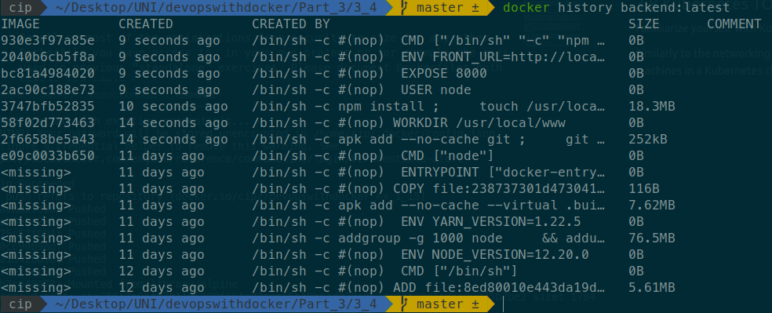

# Exercises for [part 3](https://devopswithdocker.com/part3/)

## 3.1

Return back to our [frontend](https://github.com/docker-hy/frontend-example-docker) & [backend](https://github.com/docker-hy/backend-example-docker) Dockerfiles and you should see the some mistakes we now know to fix.

Document both image sizes at this point, as was done in the material. Optimize the Dockerfiles of both programs, frontend and backend, by joining the `RUN` commands and removing useless parts.

After your improvements document the image sizes again. The size difference may not be very much yet. The frontend should be around 432MB when using FROM ubuntu:16.04. The backend should be around 351MB. The sizes may vary.

*Answer:*

*Contents of frontend `Dockerfile` (actual `Dockerfile` in folder `3_1/frontend`):*
```docker
FROM ubuntu:20.04

RUN apt-get update -y ; \
    apt-get install git curl -y ; \
    curl -sL https://deb.nodesource.com/setup_10.x | bash ; \
    apt-get install nodejs -y ; \
    apt-get purge -y --auto-remove curl ; \
    rm -rf /var/lib/apt/lists/* ; \
    node -v && npm -v ;  

CMD git clone https://github.com/docker-hy/frontend-example-docker ; \
    mv frontend-example-docker /usr/local/www ;

WORKDIR /usr/local/www

CMD npm install ; \
    npm run build ;   \
    npm install -g serve ; \
    npm run build

EXPOSE 5000

ENV API_URL=http://localhost:8000

CMD serve -s -l 5000 dist
```

*Contents of backend `Dockerfile` (actual `Dockerfile` in folder `3_1/backend`):*
```docker
FROM ubuntu:20.04

RUN apt-get update -y && apt-get install git curl -y ; \
    curl -sL https://deb.nodesource.com/setup_10.x | bash ; \
    apt install -y nodejs ; \
    node -v && npm -v ; 

CMD git clone https://github.com/docker-hy/backend-example-docker ; 

WORKDIR /usr/local/www

RUN mv backend-example-docker /usr/local/www ; \
    npm install ; \
    apt-get purge -y --auto-remove curl ; \
    rm -rf /var/lib/apt/lists/*

ENV FRONT_URL=http://localhost:5000

EXPOSE 8000

CMD npm start
```

Here is the comparison in size for the images before and after:

*Backend:*


*Frontend:*


## 3.2 A deployment pipeline to heroku *skipped*

Let’s create our first deployment pipeline!

For this exercise you can select which ever web application you already have containerized.

If you don’t have any web applications available you can use any one from this course and modify it. (Such as the course material itself)

Let’s use GitHub, CircleCI, and Heroku to deploy to heroku. You can also use GitHub actions instead of CircleCI.

CircleCI offers orbs for Heroku deployment, but you can just use the instructions from Heroku (or exercise 1.16).

Submit a link to the repository with the config.


## 3.3 Building images inside of a container TODO

Watchtower uses volume to docker.sock socket to access Docker daemon of the host from the container. By leveraging this ourselves we can create our own simple build service.

Create a project that downloads a repository from github, builds a Dockerfile located in the root and then publishes it into Docker Hub.

You can use any programming language / technology for the project implementation. A simple bash script is viable.

Then create a Dockerfile for it so that it can be run inside a container.

Make sure that it can build at least some of the example projects.

*Answer:*

The following script downloads, builds and pushes the image used in exercise 1_15:
```
#!/bin/bash

git clone https://github.com/cipz/CoronaZ/

docker build -t cipz/devopswithdocker_ex_1_15:latest CoronaZ/coronaz-zombie/.

docker login

docker push cipz/devopswithdocker_ex_1_15:latest
```

## 3.4

**This exercise is mandatory**

Security issues with the user being a root are serious for the example frontend and backend as the containers for web services are supposed to be accessible through the internet.

Make sure the containers start their processes as a non-root user.

  > TIP `man chown` may help you if you have access errors

*Answer:*

*Contents of frontend `Dockerfile` (actual `Dockerfile` in folder `3_4/frontend`):*
```docker
FROM node:12-alpine

RUN apk add --no-cache git ; \
    git clone https://github.com/docker-hy/frontend-example-docker.git /usr/local/www ; \
    apk del git

WORKDIR /usr/local/www

RUN npm install ; \
    chown -R node /usr/local/www

USER node 

EXPOSE 5000

CMD npm start
```

*Contents of backend `Dockerfile` (actual `Dockerfile` in folder `3_4/backend`):*
```docker
FROM node:12-alpine

RUN apk add --no-cache git ; \
    git clone https://github.com/docker-hy/backend-example-docker.git /usr/local/www ; \
    apk del git

WORKDIR /usr/local/www

RUN npm install ; \
    touch /usr/local/www/logs.txt ; \
    chown -R node /usr/local/www

USER node

EXPOSE 8000
ENV FRONT_URL=http://localhost:80

CMD npm start
```

*Contents of `docker-compose.yml` file (actual `docker-compose.yml` in folder 3_4):*
```docker
version: '3' 

services: 

  ex_3_4_frontend:  
    image: frontend:final
    build: ./frontend/
    ports: 
      - 5000:5000
    container_name: ex_3_4_frontend
    environment:
      - API_URL=api

  ex_3_4_backend:  
    image: backend:final
    build: ./backend/
    volumes: 
      - ./logs.txt:/usr/local/www/backend/logs.txt
    ports: 
      - 8000:8000
    environment:
      - REDIS=ex_3_4_redis
      - REDIS_PORT=6379
      - DB_USERNAME=admin
      - DB_PASSWORD=admin
      - DB_HOST=ex_3_4_postgres
      - FRONT_URL=localhost
    container_name: ex_3_4_backend
    restart: unless-stopped

  ex_3_4_redis:
    image: redis
    ports: 
      - 6379:6379
    container_name: ex_3_4_redis
  
  ex_3_4_postgres:
    image: postgres
    restart: unless-stopped
    container_name: ex_3_4_postgres
    environment:
      - POSTGRES_PASSWORD=admin
      - POSTGRES_USER=admin
    volumes:
      - database:/var/lib/postgresql/data

  ex_3_4_nginx:
    container_name: ex_3_4_nginx
    image: nginx
    volumes:
      - ./nginx.conf:/etc/nginx/nginx.conf
    ports:
      - 80:80
    depends_on:
      - ex_3_4_frontend
      - ex_3_4_backend

volumes:
  database:
```

## 3.5 Document the image size before the changes. TODO

Rather than going to `FROM alpine` or scratch, lets go look into docker-node and we should find a way how to run a container that has everything pre-installed for us. There’s even a best practices guide

Return back to our frontend & backend Dockerfiles and change the FROM to something more suitable. Make sure the application still works after the changes.

Document the size after this change. If you used the alpine version the size for frontend can be less than 250MB. The backend can be below 150MB.

*Answer:*

For this exercise I used the same images of exercise 3_4.
Here are the sizes of the images:

*Backend:*


*Frontend:*


## 3.6

Multi-stage builds. Lets do a multi-stage build for the frontend project since we’ve come so far with the application.

Even though multi-stage builds are designed mostly for binaries in mind, we can leverage the benefits with our frontend project as having original source code with the final assets makes little sense. Build it with the instructions in README and the built assets should be in dist folder.

You can still use the serve to serve the static files or try out something else.

*Answer:*

*Contents of the `Dockerfile` (actual `Dockerfile` in folder 3_6):*

```docker
FROM node:12-alpine3.12 as build-stage

WORKDIR /app

ENV API_URL=http://localhost:8000

RUN apk add --no-cache git && \
    git clone https://github.com/docker-hy/frontend-example-docker.git . && \
    npm install && \
    apk del git && \
    npm run build

FROM nginx:alpine

COPY --from=build-stage /app/dist/ /usr/share/nginx/html/

EXPOSE 80
```

## 3.7

Do all or most of the optimizations from security to size for any other Dockerfile you have access to, in your own project or for example the ones used in previous “standalone” exercises. Please document Dockerfiles both before and after.

## 3.8 Kubernetes

Familiarize yourself with Kubernetes terminology and draw a diagram.

Similarly to the networking diagrams in part 2. You will need to draw a diagram of at least three host machines in a Kubernetes cluster. The cluster is running two applications. The applications can be anything you want. An example could be a videogame server and a blog website.

The applications may utilize other machines or APIs that are not part of the cluster. At least three of the machines should be utilized. Include “your own computer” in the diagram as the one sending instructions via kubectl to deploy an application. In addition include a HTTP message coming from the internet to your Kubernetes cluster and how it may reach an application.

Make sure to label the diagram so that anyone else who has completed this exercise, and read the glossary, would undestand it. The diagram should contain at least four of the following labels: Pod, Cluster, Container, Service and a Volume.

Glossary. And some helpful diagrams

I prefer to use draw.io but you can use whichever tool you want.

*Answer:*

The following diagram represents the system of the CoronaZ project, used in exercise 1_15, as if it was running inside a Kubernetes cluster:

